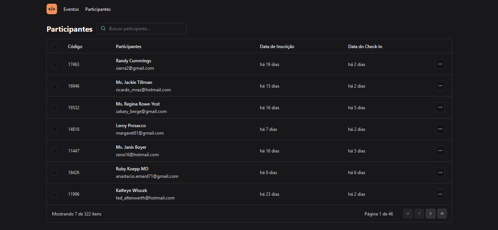

# Pass-In

> Status: finished ✔️

_Read this in other languages:_
[_Português_](./translations/README-ptBR.md)

## About the project

This project serves as an interface designed to mimic participant management within an event context. It leverages the FakerJS library to generate fictitious data, including names, dates, and emails, thus illustrating the functionality of the program.

## Example photo

## Technologies Used and Dependencies

<table>
  <tr>
    <td>Vite</td>
    <td>React</td>
    <td>Typescript</td>
    <td>Tailwind CSS</td>
    <td>Faker JS</td>
  </tr>
  <tr>
    <td>^5.2.0</td>
    <td>^18.2.0</td>
    <td>^5.2.2</td>
    <td>^3.4.3</td>
    <td>^8.4.1</td>
  </tr>
</table>

## How to use

[Click Here](https://eriksgda.github.io/Pass-In/) to go to the website and see the project.

## License

This project is under [MIT](./LICENSE) license
